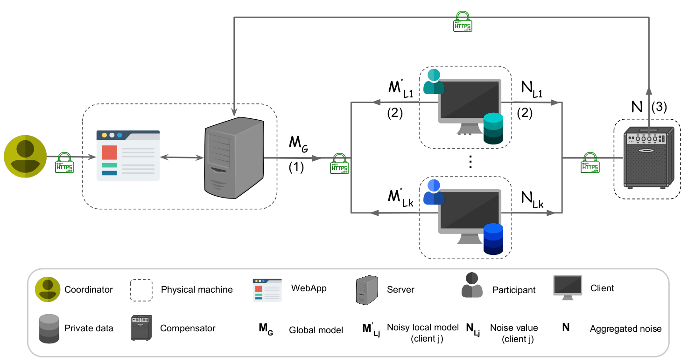

# Federated Principal Component Analysis

## __Hybrid federated principal component analysis for Privacy-preserving Machine Learning__

## About
**Federated PCA** is a web based tool demonstrating the feasibiliy of federated learning, more specifically federated principal component analysis. It is developed at the Computational Biology Group at the University of Southern Denmark (SDU). The tool is based on the framework **HyFed** developed at Technical University of Munich (TUM).
Federated PCA consists of four main components: 
1. **WebApp** to set up the (hyper-)parameters of the federated algorithm
2. **Client** to compute the local model and perturb it with noise 
3. **Compensator** to calculate the aggregated noise by aggregating the noise values from the clients
4. **Server** to coordinate the training process and compute the global model by adding up the noisy local models from the clients and 
   the negative of the aggregated noise from the compensator
   

   
Federated PCA obfuscates the local parameters of a client from the aggregation server without adversely affecting the accuracy of the global model. 

To see how to **install** the **Federated PCA** framework, please see [HyFed-Install](hyfed-docs/readme/install_hyfed.md).  
To **run** the **HyFed** framework, please see [HyFed-Run](hyfed-docs/readme/run_hyfed.md).  

## License
The **HyFed** and **FederatedPCA** source codes are licensed under the Apache License Version 2.0. (C) 2021, the **HyFed** developers and Federated PCA developers.

## Acknowledgement
This software is based on the **HyFed** framework developed at [TUM-AIMED](https://github.com/TUM-AIMED/hyfed). To learn more about **HyFed**, please read the [HyFed manuscript](https://arxiv.org/abs/2105.10545).

   ## Contact
In case of questions or problems regarding **Federated PCA**, please contact the  developers: Anne Hartebrodt
   
## Disclaimer

This framework is a research product and is provided as it is. We assume no liability for any user action or omission.
